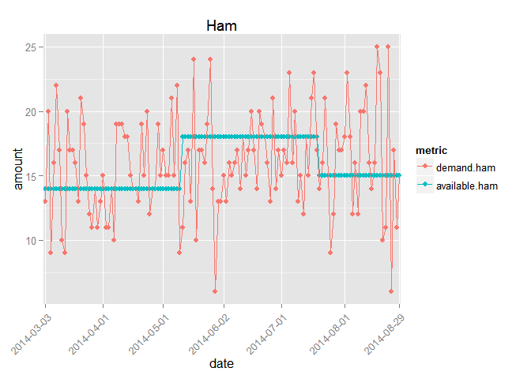
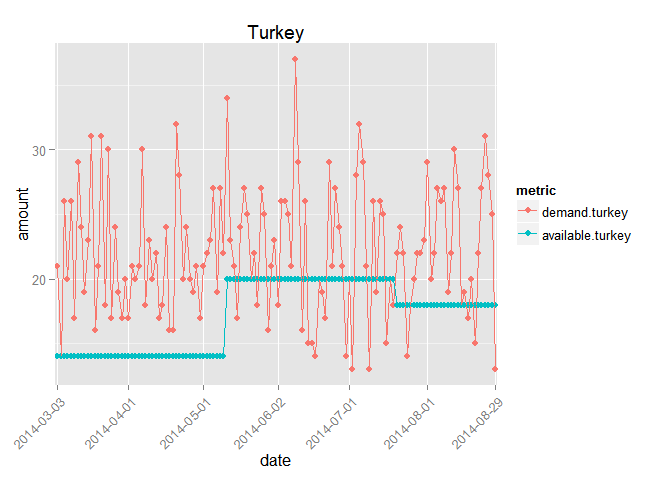
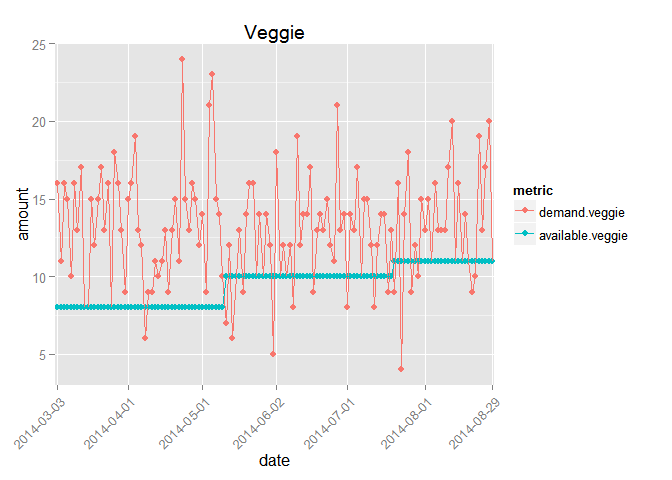

# IS606_Collaborate_Markdown_1


##Initial Thoughts
An initial question to be answered is whether the answer to this question should be a probabilistic one or a simulation.  While a statistician might initially choose the first, the second is better to actually see results.


##Assumptions
Our assumptions include:

* Customers and the orders they make are independent of each other
    + While this may not be true in the real world, as someone's order may influence the order of the next person, it is easier to pretend that they are not


##First Look

```r
library(ggplot2)
library(reshape2)
details <- read.csv("details.csv", header=T)
sales <- read.csv("sales.csv", header=T)
attach(sales)
demand <- melt(sales[1:4], id.vars="date", variable.name="type", value.name="demand")
supply <- melt(sales[c(1,5,6,7)], id.vars="date", variable.name="type", value.name="supply")
ham <- melt(sales[c(1,2,5)], id.vars="date", variable.name="metric", value.name="amount")
turkey <- melt(sales[c(1,3,6)], id.vars="date", variable.name="metric", value.name="amount")
veggie <- melt(sales[c(1,4,7)], id.vars="date", variable.name="metric", value.name="amount")
plotHam <- ggplot(data=ham, aes(x=date, y=amount, group=metric, color=metric)) + geom_point() + geom_line() +
theme(axis.text.x = element_text(angle = 45, hjust = 1)) +
scale_x_discrete(breaks=c("2014-03-03", "2014-04-01", "2014-05-01", "2014-06-02", "2014-07-01", "2014-08-01", "2014-08-29")) +
ggtitle("Ham")
plotTurkey <- ggplot(data=turkey, aes(x=date, y=amount, group=metric, color=metric)) + geom_point() + geom_line() +
theme(axis.text.x = element_text(angle = 45, hjust = 1)) +
scale_x_discrete(breaks=c("2014-03-03", "2014-04-01", "2014-05-01", "2014-06-02", "2014-07-01", "2014-08-01", "2014-08-29")) +
ggtitle("Turkey")
plotVeggie <- ggplot(data=veggie, aes(x=date, y=amount, group=metric, color=metric)) + geom_point() + geom_line() +
theme(axis.text.x = element_text(angle = 45, hjust = 1)) +
scale_x_discrete(breaks=c("2014-03-03", "2014-04-01", "2014-05-01", "2014-06-02", "2014-07-01", "2014-08-01", "2014-08-29")) +
ggtitle("Veggie")
```

<!-- Some comments about each of the graphs? -->

```r
plotHam
```

 


```r
plotTurkey
```

 


```r
plotVeggie
```

 


##Analysis of Historical Data


##Why Poisson distribution


##Simulation


###Assuming there is no storage of sandwiches after each day


###Assuming there is storage of unsold sandwiches after each day


##Interpretations and Recommendations

