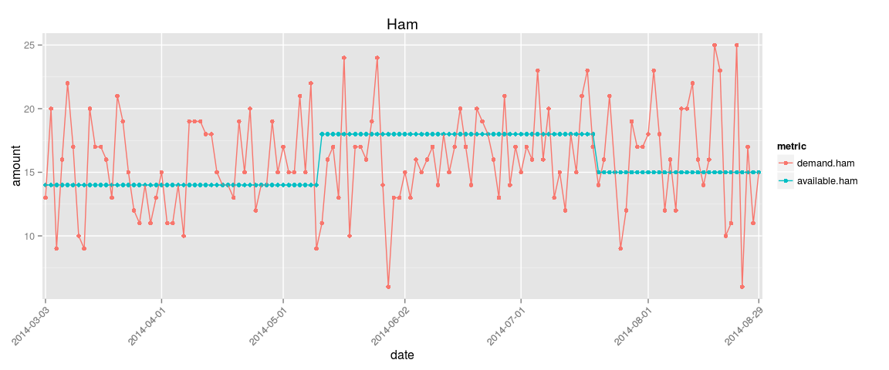
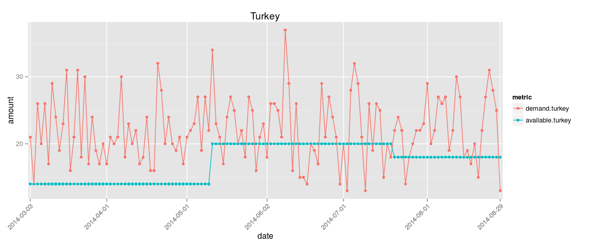
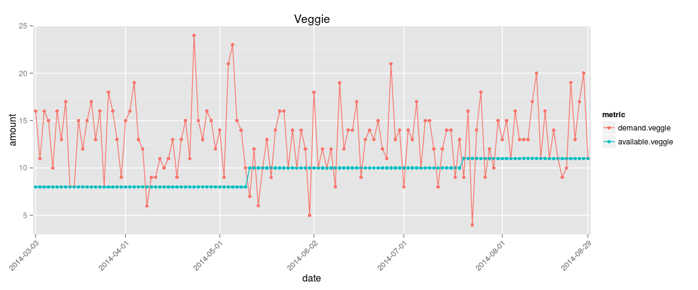
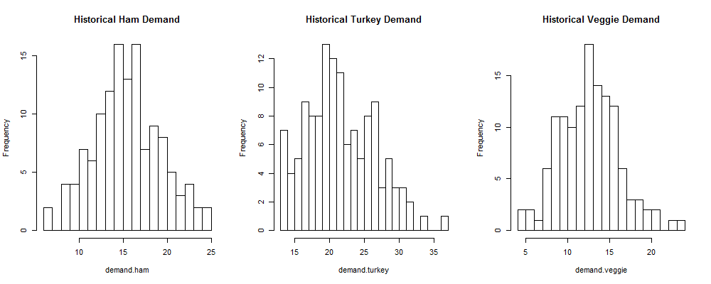
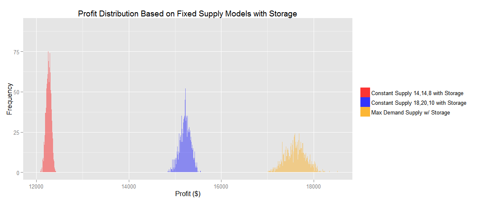
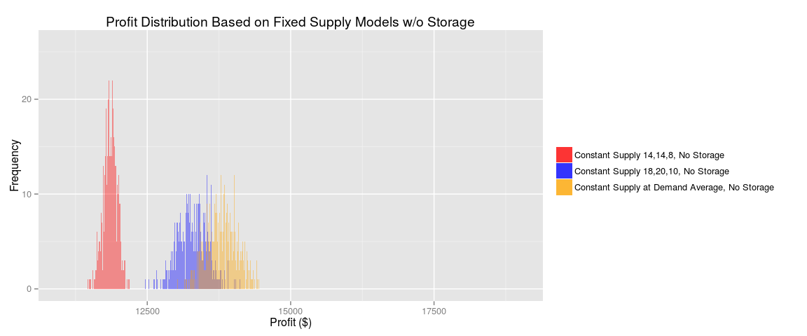
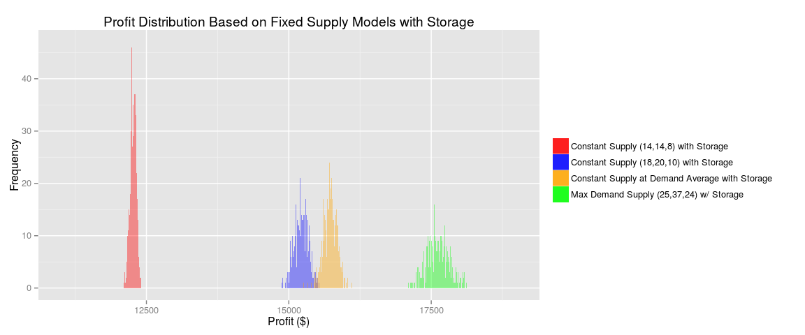

# Sandwich Tycoon
Brian C., James Q., Rohan F., Sharad G.  

### Preliminary Analysis

After plotting histograms and scatterplots of the historical data, it was evident that:  

* Demand can be modeled as a random variable.
* Very often sandwich demand exceeded supply.
* Daily sandwich demand was independent of previous demand.
* Customer orders are independent of each other during the course of the day.
* No obvious long-term demand trend upwards or downwards (linear regression, $a<.02$ and $r2<.0001$ for all types)

### Initial Graphs

   

### Objective

To maximize total sandwich profits over a 130-day period by estimating probability of demand and producing a fixed or variable quantity of supply.

### General Strategy

Sandwiches sold is a discrete variable and therefore can be estimated using a probability mass function. We forecasted demand using two different probability distributions. The first was to use the historical frequency: This distribution would match the probability ($X=x$) of the preceding period. 

The second one is based on the frequency distribtutions suggest a probability distribution. Since, there is no constraint on the number of events and the outcomes are independent, we chose Poisson distribution as a candidate. In order to use Poisson distribution, we calculated lambda from historica data that gave us sandwich demand per day.

 

James previously supplied sandwiches at a mostly fixed amount. We used a fixed supply model for the historical distribution but modeled the poisson distribution under both fixed and variable supply assumptions.

A 130-day period was chosen to match the timeline of the given data. This allows for direct benchmarking (given below assumptions) against 1) profits that James actually made in the preceding 130 days, and 2) a gold standard profit margin that was achievable over 130 days if supply always met demand every day.

### General Assumptions

* Demand for each sandwich type is independent. What a customer orders is independent of what was ordered before.
* Each customer only counts towards demand of one sandwich type. Therefore, if a customer wanted ham but it was sold out and turkey was bought instead, demand would count as 1 ham, 0 turkey. This means the sum of total demand equals the total number of customers who visited on a given day
* Future demand will closely match historical demand. Again, there was no evident long-term trend and we have no information to assume a drastic drop or growth over the next 130 days (e.g. more people in the building, other competition, vegan explosion, swine flu epidemic)
* There are no added fixed costs to increasing supply (e.g. hiring helpers, more preparation space/tools)
* Supply goes to waste if not sold in a day. We vary this assumption in our second Poisson distribution model in that unsold sandwiches are reused (and thus increase future supply).  

### Profit Results

#### A) Previously achieved - $12,828  

Given James' actual supply and demand over the 130-day period, he achieved the following:

|Type   |Revenue |Cost    |Profit  |
|:------|:-------|:-------|:-------|
|Ham    |$12,012 |$7,175  |$4,837  |
|Turkey |$14,066 |$8,960  |$5,106  |
|Veggie |$5,960  |$3,075  |$2,885  |
|Total  |$32,038 |$19,210 |$12,828 |

#### B) Historical Probability Distribution - $13,858  

We used historical frequency of each demand amount to determine the probability ($X=x$) of each sandwich sold on a given day. With this probability distribution, we simulated 10,000 trials over a 130-day period to get our demand estimate. Under our assumption of fixed supply, we calculated the revenue, cost, and profit for each fixed number of sandwiches produced (over the demand range of each sandwich type).  

The results demonstrate that the optimal fixed number of sandwiches to supply per day is equal to the expected value, which under a specific frequency distribution is the highest frequency value (ham: $n=15$ $p=0.123$, turkey: $n=20$ $p=0.1$, veggie: $n=13$ $p=.138$). 

|Type   |Revenue |Cost    |Profit  |
|:------|:-------|:-------|:-------|
|ham    |$11,765 |$6,825  |$4,940  |
|turkey |$16,003 |$10,400 |$5,603  |
|veggie |$7,540  |$4,225  |$3,315  |
|total  |$35,308 |$21,450 |$13,858 |

#### C) Poisson Distribution - Fixed Supply Without Storage (unsold sandwiches are wasted)

We assume that James will bring in a fixed amount every day and has no way to store excess sandwiches. We choose 3 different models:

  * Using the lowest numbers from the data: 14 ham, 14 turkey, and 8 veggie sandwiches
  * Using the higher numbers from the data: 18 ham, 20 turkey, and 10 veggie sandwiches
  * Using the mean demand for each sandwich from the data: 16 ham, 22 turkey, and 13 veggie sandwiches
  
Note: we do not show maximum demand model on this graph, since with no storage, this reduces profits by a wide margin.

 

#### D) Fixed Supply With Storage (unsold sandwiches are put back into supply)

We assume that James will bring in a fixed amount every day but this time does have a wat store excess sandwiches. We choose 4 different models:

  * Using the lowest numbers from the data: 14 ham, 14 turkey, and 8 veggie sandwiches
  * Using the higher numbers from the data: 18 ham, 20 turkey, and 10 veggie sandwiches
  * Using the mean demand for each sandwich from the data: 16 ham, 22 turkey, and 13 veggie sandwiches
  * Using the maximum demand model for each sandwich from the data: 25 ham, 37 turkey, and 24 veggie sandwiches

 

#### E) Gold Standard - $17,631  

This is the profit that would have been made if supply = demand each day (variable supply model) so that no sandwich was wasted and every customer was satisfied. Comparing the previous methods as percent of gold standard achieved, we see the "fixed supply at avergae demand, no storage model" yielded **78.2661%** while the "fixed supply at avergae demand, storage model" yielded **89.189%**.

### Recommendations

* If using a fixed supply with no storage, then it should be set to expected value of each demand variable (i.e., supply of ham, turkey and veggie sandwiches should be 16, 22, 13, respectively). This will show an immediate increase in profits.
* Poisson distribution fit historical data very well - can use as distribution function going forward
* Consider investing in fridge, etc. to prolong product shelf life. Without storage, when you over-shoot on supply (i.e. customer demand is to the left of the mean), you lose money in waste. Having storage allows you to overshoot without having to bear that extra cost.
* Being able to carry over supply day-to-day greatly increases expected profit
* If overestimating demand, we recommend veggie because the profit margin is the same as turkey but the cost is the least.
* If underestimate demand, we recommend turkey because the cost is the highest but the profit is same as veggie.

### Limitations

* Simple model assuming external factors not changing
* Will historical demand ~ Future demand?
* Covariance. If no turkey is produced, could some/all switch to higher margin ham?
* Fixed supply costs in real world would likely increase
* In variable model, 3-day old sandwich is as 'desirable' as fresh one
