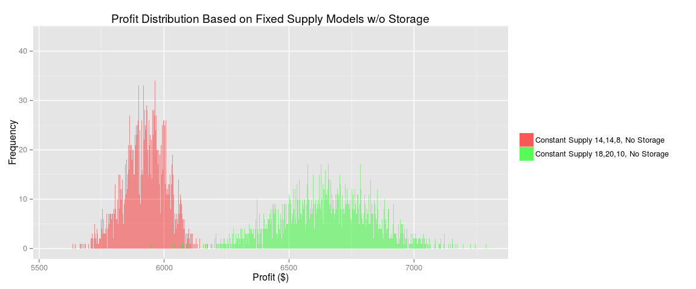
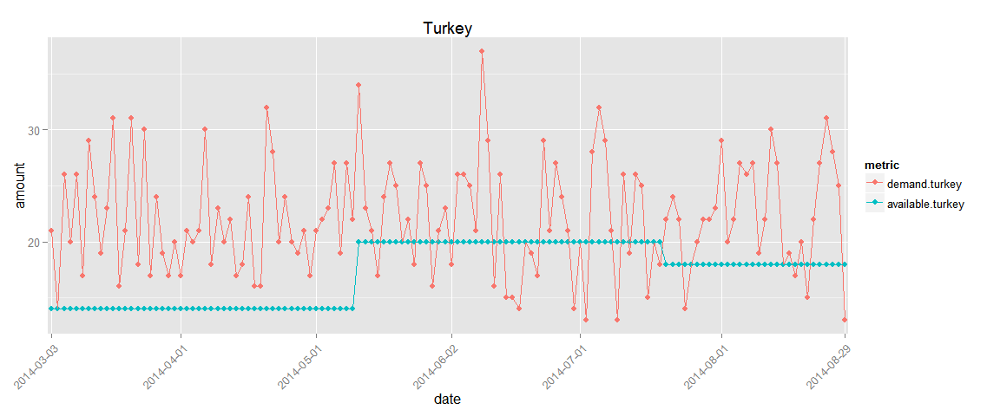

# Sandwich Tycoon
Brian C., James Q., Rohan F., Sharad G.  

###Initial Thoughts

After plotting histograms and scatterplots of the historical data, it was evident that:  

* Demand fluctuated heavily day to day
* James was often undersupplying all types of sandwiches (i.e. demand > supply)
* There were no imminent customer patterns based on day of sale (e.g first day of each week had XX sales) or sandwich conditionality (e.g. if previous day sold X, next day would sell Y)
* No obvious long-term demand trend upwards or downwards (linear regression, $a<.02$ and $r2<.0001$ for all types)

See Appendix:Initial Graphs

###Objective
To maximize total sandwich profits over a 130-day period by estimating probability of demand and producing a fixed or variable quantity of supply.

###General Strategy
Sandwiches sold is a discrete variable and therefore can be estimated using a probability mass function. We forecasted demand using two different probability distributions, namely:

1. Historical frequency: This distribution would match the probability ($X=x$) of the preceding period. 

2. Poisson distribution: This is an applicable distribution because we want the probability of a discrete number of occurences in a fixed period of time (i.e. sandwiches sold in a day)

<!--
==For each case, a simulation approach was appropriate to increase the precision of the probability estimate **(not sure this is right wording**)

==We ran simulations to best model these approaches in order to achieve a precise estimate of supply
-->

James previously supplied sandwiches at a mostly fixed amount. We used a fixed supply model for the historical distribution but modeled the poisson distribution under both fixed and variable supply assumptions.

A 130-day period was chosen to match the timeline of the given data. This allows for direct benchmarking (given below assumptions) against 1) profits that James actually made in the preceding 130 days, and 2) a gold standard profit margin that was achievable over 130 days if supply always met demand every day.

###General Assumptions
* Demand for each sandwich type is independent. What a customer orders is independent of what was ordered before.
* Each customer only counts towards demand of one sandwich type. Therefore, if a customer wanted ham but it was sold out and turkey was bought instead, demand would count as 1 ham, 0 turkey. This means the sum of total demand equals the total number of customers who visited on a given day
* Future demand will closely match historical demand. Again, there was no evident long-term trend and we have no information to assume a drastic drop or growth over the next 130 days (e.g. more people in the building, other competition, vegan explosion, swine flu epidemic)
* There are no added fixed costs to increasing supply (e.g. hiring helpers, more preparation space/tools)
* Supply goes to waste if not sold in a day. We vary this assumption in our second Poisson distribution model in that unsold sandwiches are reused (and thus increase future supply).  
<!--More assumptions?-->

###Profit Results
####A) Previously achieved - $12,828  

Given James' actual supply and demand over the 130-day period, he achieved the following:

\begin{table}[!htbp]
  \label{} 
\begin{tabular}{@{\extracolsep{5pt}} ccccc} 
\\[-1.8ex]\hline 
\hline \\[-1.8ex] 
type & revenue & cost & profit \\ 
\hline \\[-1.8ex] 
ham & $12,012$ & $7,175$ & $4,837$ \\ 
turkey & $14,066$ & $8,960$ & $5,106$ \\ 
veggie & $5,960$ & $3,075$ & $2,885$ \\ 
total & $32,038$ & $19,210$ & $12,828$ \\ 
\hline \\[-1.8ex] 
\end{tabular} 
\end{table} 

####B) Historical Probability Distribution - $13,858  

We used historical frequency of each demand amount to determine the probability ($X=x$) of each sandwich sold on a given day. With this probability distribution, we simulated 10,000 trials over a 130-day period to get our demand estimate. Under our assumption of fixed supply, we calculated the revenue, cost, and profit for each fixed number of sandwiches produced (over the demand range of each sandwich type).  

The results demonstrate that the optimal fixed number of sandwiches to supply per day is equal to the expected value, which under a specific frequency distribution is the highest frequency value (ham: $n=15$ $p=0.123$, turkey: $n=20$ $p=0.1$, veggie: $n=13$ $p=.138$). 

\begin{table}[!htbp]
  \label{} 
\begin{tabular}{@{\extracolsep{5pt}} ccccc} 
\\[-1.8ex]\hline 
\hline \\[-1.8ex] 
type & revenue & cost & profit \\ 
\hline \\[-1.8ex] 
ham & $11,765$ & $6,825$ & $4,940$ \\ 
turkey & $16,003$ & $10,400$ & $5,603$ \\ 
veggie & $7,540$ & $4,225$ & $3,315$ \\ 
total & $35,308$ & $21,450$ & $13,858$ \\ 
\hline \\[-1.8ex] 
\end{tabular} 
\end{table} 

**(insert charts - frequency distribution, marginal profit curve?)**

####C) Poisson Distribution - Fixed Supply

**include that lambda = expected value = optimum supply level**

#####Without Storage (unsold sandwiches are wasted)
 

#####With Storage (unsold sandwiches are put back into supply)
 

####D) Poisson Distribution - Variable Supply

 

####E) Gold Standard - $17,631  

This is the profit that would have been made if supply=demand each day so that no sandwich was wasted and every customer was satisfied. Comparing the previous methods as percent of gold standard achieved, we see the poisson variable supply model yielded XX% while the poisson fixed model and historical probability model yielded XX% and $78.6\%$, respectively.

###Recommendations

* If fixed supply, produce at rate of expected value 
* Poisson distribution fit historical data very well - can use as distribution function going forward
* Consider investing in fridge, etc. to prolong product shelf life
  - Being able to carry over supply day-to-day greatly increases expected profit

###Limitations

* Simple model assuming external factors not changing
* Will historical demand ~ Future demand?
* Covariance. If no turkey is produced, could some/all switch to higher margin ham?
* Fixed supply costs in real world would likely increase
* In variable model, 3-day old sandwich is as 'desirable' as fresh one

#Appendix
###Initial Graphs

   
